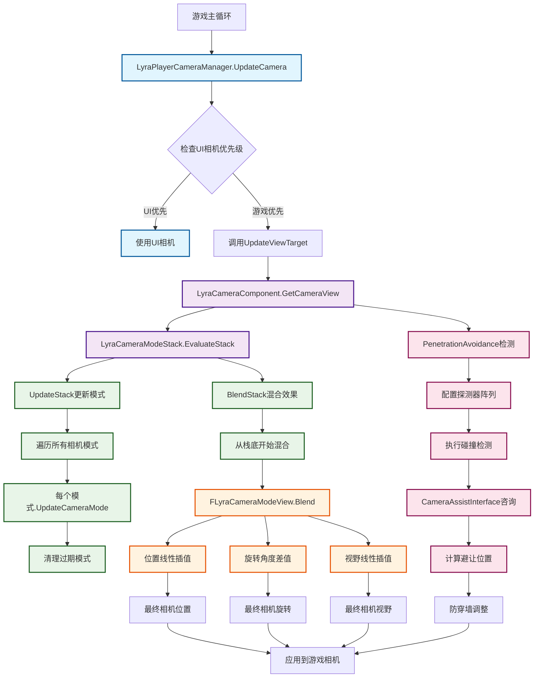
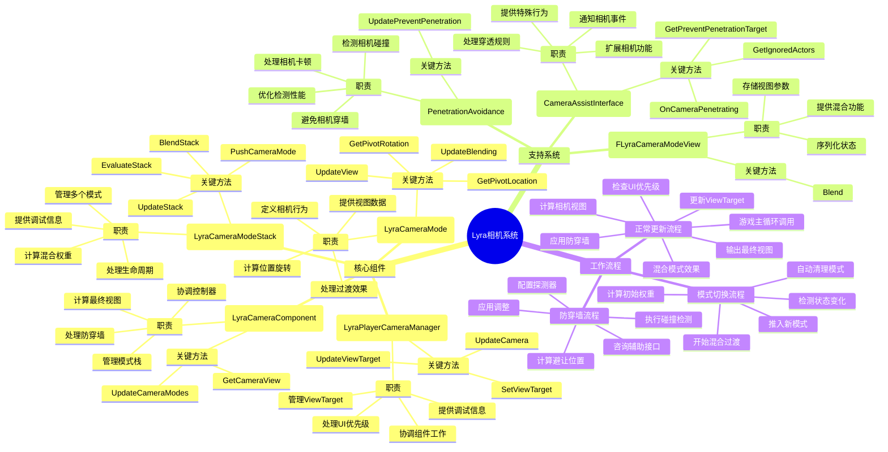
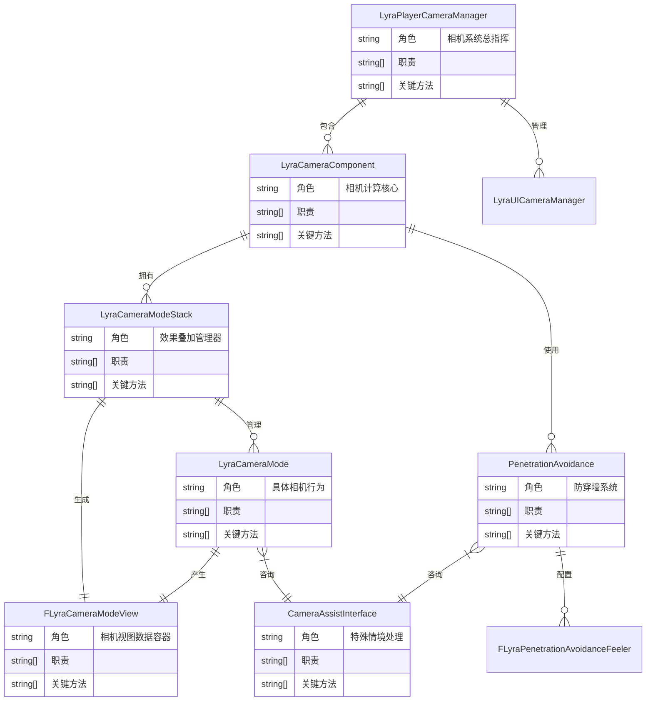

# Lyra相机系统Mermaid图表

## 1. 系统协作流程图

```mermaid
graph TD
    %% 主流程图 - Lyra相机系统协作关系
    
    %% 入口点
    A[游戏主循环] --> B[LyraPlayerCameraManager.UpdateCamera]
    
    %% 相机管理器流程
    B --> C{检查UI相机优先级}
    C -->|UI优先| D[使用UI相机]
    C -->|游戏优先| E[调用UpdateViewTarget]
    
    %% 相机组件流程
    E --> F[LyraCameraComponent.GetCameraView]
    F --> G[LyraCameraModeStack.EvaluateStack]
    
    %% 模式栈更新流程
    G --> H[UpdateStack更新模式]
    H --> I[遍历所有相机模式]
    I --> J[每个模式.UpdateCameraMode]
    J --> K[清理过期模式]
    
    %% 混合流程
    G --> L[BlendStack混合效果]
    L --> M[从栈底开始混合]
    M --> N[FLyraCameraModeView.Blend]
    N --> O[位置线性插值]
    N --> P[旋转角度差值]
    N --> Q[视野线性插值]
    
    %% 防穿墙流程
    F --> R[PenetrationAvoidance检测]
    R --> S[配置探测器阵列]
    S --> T[执行碰撞检测]
    T --> U[CameraAssistInterface咨询]
    U --> V[计算避让位置]
    
    %% 最终输出
    O --> W[最终相机位置]
    P --> X[最终相机旋转]
    Q --> Y[最终相机视野]
    V --> Z[防穿墙调整]
    
    W --> AA[应用到游戏相机]
    X --> AA
    Y --> AA
    Z --> AA
    
    %% 样式定义
    classDef manager fill:#e1f5fe,stroke:#01579b,stroke-width:2px
    classDef component fill:#f3e5f5,stroke:#4a148c,stroke-width:2px
    classDef mode fill:#e8f5e8,stroke:#1b5e20,stroke-width:2px
    classDef data fill:#fff3e0,stroke:#e65100,stroke-width:2px
    classDef system fill:#fce4ec,stroke:#880e4f,stroke-width:2px
    
    class B,D manager
    class F,G component
    class H,I,J,K,L,M mode
    class N,O,P,Q data
    class R,S,T,U,V system
```

## 2. 思维导图

```mermaid
mindmap
  root((Lyra相机系统))
    
    %% 核心组件
    核心组件
      相机管理器(LyraPlayerCameraManager)
        职责
          管理ViewTarget
          处理UI优先级
          协调组件工作
          提供调试信息
        关键方法
          UpdateCamera
          SetViewTarget
          UpdateViewTarget
      
      相机组件(LyraCameraComponent)
        职责
          管理模式栈
          计算最终视图
          处理防穿墙
          协调控制器
        关键方法
          GetCameraView
          UpdateCameraModes
      
      模式栈(LyraCameraModeStack)
        职责
          管理多个模式
          计算混合权重
          处理生命周期
          提供调试信息
        关键方法
          PushCameraMode
          EvaluateStack
          UpdateStack
          BlendStack
      
      相机模式(LyraCameraMode)
        职责
          定义相机行为
          计算位置旋转
          处理过渡效果
          提供视图数据
        关键方法
          UpdateView
          UpdateBlending
          GetPivotLocation
          GetPivotRotation
    
    %% 支持系统
    支持系统
      视图数据(FLyraCameraModeView)
        职责
          存储视图参数
          提供混合功能
          序列化状态
        关键方法
          Blend
      
      防穿墙(PenetrationAvoidance)
        职责
          检测相机碰撞
          避免相机穿墙
          处理相机卡顿
          优化检测性能
        关键方法
          UpdatePreventPenetration
      
      辅助接口(CameraAssistInterface)
        职责
          提供特殊行为
          处理穿透规则
          通知相机事件
          扩展相机功能
        关键方法
          GetIgnoredActors
          GetPreventPenetrationTarget
          OnCameraPenetrating
    
    %% 工作流程
    工作流程
      正常更新流程
        游戏主循环调用
        检查UI优先级
        更新ViewTarget
        计算相机视图
        混合模式效果
        应用防穿墙
        输出最终视图
      
      模式切换流程
        检测状态变化
        推入新模式
        计算初始权重
        开始混合过渡
        自动清理模式
      
      防穿墙流程
        配置探测器
        执行碰撞检测
        咨询辅助接口
        计算避让位置
        应用调整
```

## 3. 组件关系图

```mermaid
erDiagram
    %% Lyra相机系统组件关系图
    
    LyraPlayerCameraManager ||--o{ LyraCameraComponent : "包含"
    LyraPlayerCameraManager ||--o{ LyraUICameraManager : "管理"
    
    LyraCameraComponent ||--o{ LyraCameraModeStack : "拥有"
    LyraCameraComponent ||--o{ PenetrationAvoidance : "使用"
    
    LyraCameraModeStack ||--o{ LyraCameraMode : "管理"
    LyraCameraModeStack ||--|| FLyraCameraModeView : "生成"
    
    LyraCameraMode ||--|| FLyraCameraModeView : "产生"
    LyraCameraMode }|--|| CameraAssistInterface : "咨询"
    
    PenetrationAvoidance ||--o{ FLyraPenetrationAvoidanceFeeler : "配置"
    PenetrationAvoidance }|--|| CameraAssistInterface : "咨询"
    
    %% 组件属性
    LyraPlayerCameraManager {
        string 角色 "相机系统总指挥"
        string[] 职责
        string[] 关键方法
    }
    
    LyraCameraComponent {
        string 角色 "相机计算核心"
        string[] 职责
        string[] 关键方法
    }
    
    LyraCameraModeStack {
        string 角色 "效果叠加管理器"
        string[] 职责
        string[] 关键方法
    }
    
    LyraCameraMode {
        string 角色 "具体相机行为"
        string[] 职责
        string[] 关键方法
    }
    
    FLyraCameraModeView {
        string 角色 "相机视图数据容器"
        string[] 职责
        string[] 关键方法
    }
    
    PenetrationAvoidance {
        string 角色 "防穿墙系统"
        string[] 职责
        string[] 关键方法
    }
    
    CameraAssistInterface {
        string 角色 "特殊情境处理"
        string[] 职责
        string[] 关键方法
    }
```

