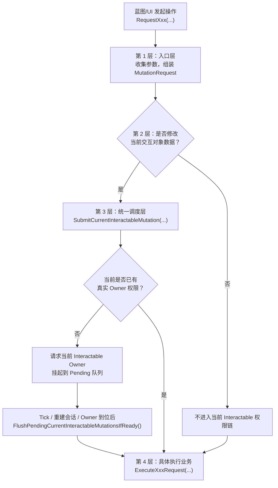
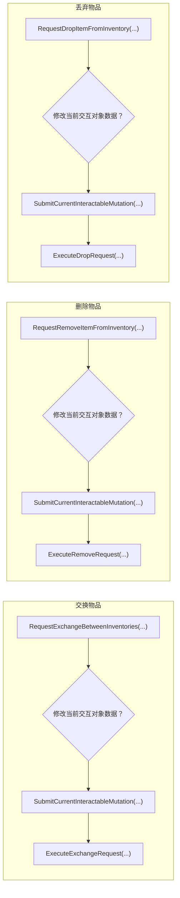
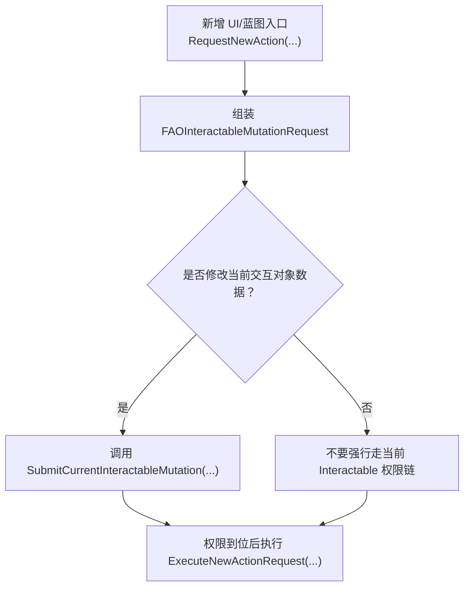

# 交互系统 Mutation 权限等待与统一调度设计说明

更新日期：2026-05-04

这份文档不是在讲某一个具体功能，而是在明确当前交互系统里一条必须长期稳定的公共链路：

**凡是会修改“当前交互对象数据”的操作，都必须复用同一套“权限等待 + 挂起排队 + 权限到位后放行”的调度链。**

这套设计的目标不是只服务“交换物品”这一件事，而是服务于未来所有同类操作，例如：

- 交换物品
- 删除物品
- 丢弃物品
- 整理容器
- 拆分堆叠
- 合并堆叠
- 未来任何“通过 UI 修改当前交互对象数据”的行为

---

## 一、先说结论：真正应该共用的是第 2 层和第 3 层

如果把一次交互修改拆成几层，推荐统一按下面四段来理解：

1. 命令入口层
2. 是否需要等待当前交互对象权限
3. 统一调度层
4. 具体业务执行层

这四段里：

- 第 1 层可以不同
- 第 4 层可以不同
- **第 2 层和第 3 层必须共用**

也就是说：

- `交换` 和 `删除` 的 UI 入口可以不同
- `交换` 和 `删除` 的底层执行函数也可以不同
- 但只要它们都在修改“当前交互对象”的数据，就都必须先经过同一套权限等待链

这就是这次设计中最重要的抽离目标。

---

## 二、四层职责必须怎么分

### 1. 命令入口层

这一层存在于：

- 蓝图 UI 按钮
- 拖拽释放
- 右键菜单
- 快捷操作
- 其他任何玩家发起操作的入口

它的职责只有两件事：

- 收集参数
- 组装一个 mutation 请求

它不负责：

- 判断网络权限什么时候到
- 自己维护等待状态
- 自己写一套排队逻辑

也就是说，入口层只是“把动作翻译成请求”，而不是“自己处理权限问题”。

---

### 2. 是否需要等待当前交互对象权限

这一层是整个设计里最容易被误写的地方。

正确问题不是：

- 这是不是交换？
- 这是不是删除？
- 这是不是丢弃？

正确问题只有一个：

**这次操作是否会修改“当前交互对象”的数据？**

如果答案是“会”，那么它就必须进入统一权限等待链。

例如：

- 玩家把背包物品拖进当前打开的箱子：会修改箱子数据，必须等待
- 玩家在当前打开的箱子里删除一个物品：会修改箱子数据，必须等待
- 玩家在当前打开的箱子里把一个物品丢弃到世界：会修改箱子数据，必须等待
- 玩家整理当前箱子里的槽位：会修改箱子数据，必须等待

反过来，如果某个操作根本不修改当前交互对象的数据，那么它不应该硬塞进这条链里。

这意味着我们统一的是“是否触及当前交互对象”，不是“库存操作”这个大类本身。

---

### 3. 统一调度层

这一层是这次设计真正要稳定下来的公共基础设施。

它只负责这些事情：

- 当前有没有 active session
- 当前有没有 interactable actor
- 当前 interactable 的真实 Owner 是否已经是当前玩家
- 如果权限未到，申请 Owner
- 如果权限未到，把请求挂起
- 如果权限到了，把挂起请求放行执行

这一层绝不能关心：

- 当前请求是不是交换
- 当前请求是不是删除
- 当前请求是不是丢弃
- 当前请求对应哪个对象类型

也就是说，调度层只处理“什么时候能执行”，不处理“执行什么”。

这就是为什么它必须是共用的。

---

### 4. 具体业务执行层

这一层才是真正的业务逻辑层。

例如未来应该长成这种形式：

- `ExecuteExchangeRequest(...)`
- `ExecuteRemoveRequest(...)`
- `ExecuteDropRequest(...)`
- `ExecuteSortRequest(...)`
- `ExecuteSplitRequest(...)`

这些函数的职责是：

- 检查业务参数是否合法
- 执行真正的数据改动
- 调用 RPC 或 authority 路径

它们不应该再关心：

- 当前交互对象 Owner 是否已经到位
- 是否需要等待权限
- 是否需要挂起排队

因为这些问题应该已经在第 2 层和第 3 层被解决完了。

---

## 三、这次设计里，已经抽离出来的公共部分是什么

当前代码里，这套共用层已经开始成型，关键位置如下：

- [AOInteractionSessionComponent.h](/D:/UE_Project/AO/AegisOdyssey/AegisOdyssey/Source/AegisOdyssey/Interaction/AOInteractionSessionComponent.h)
- [AOInteractionSessionComponent.cpp](/D:/UE_Project/AO/AegisOdyssey/AegisOdyssey/Source/AegisOdyssey/Interaction/AOInteractionSessionComponent.cpp)
- [AOInventoryUI.cpp](/D:/UE_Project/AO/AegisOdyssey/AegisOdyssey/Source/AegisOdyssey/UI/Widgets/Inventory/AOInventoryUI.cpp)

本次抽离出的关键公共抽象有两个：

### 1. `FAOInteractableMutationRequest`

它代表“一次准备修改当前交互对象数据的请求”。

当前它至少包含：

- `DebugName`
- `ValidateAction`
- `ExecuteAction`

这意味着调度层看到的已经不是“交换专用函数”，而是一个通用 mutation 请求。

---

### 2. `SubmitCurrentInteractableMutation(...)`

这是当前统一调度入口。

它承担的职责是：

- 收到一个 mutation 请求
- 判断当前是否已具备真实权限
- 如果具备，立即执行
- 如果不具备，挂起请求并申请当前 interactable owner
- 后续在权限真正到位时再统一放行

这一步很关键，因为它说明：

- 现在不是“交换逻辑里顺带等权限”
- 而是“交换只是提交了一个 mutation 请求，真正的等待逻辑发生在公共调度层”

这正是我们想要的抽离方向。

---

## 四、为什么这套抽离不是“只能服务当前交换链”

如果当前设计仍然是下面这种样子，那它就只服务于交换：

- `RequestExchange...`
- 内部直接写一整套权限判断
- 内部直接写一整套等待状态
- 内部再直接调用交换函数

这样以后新增 `删除`、`丢弃`、`整理` 时，必然会出现：

- 再复制一份等待逻辑
- 再复制一份 owner 申请逻辑
- 再加新的等待布尔
- 再加新的专用分支

那系统很快就会重新回到补丁式复杂度。

而当前已经做出的抽离是：

- 入口动作变成“构造请求”
- 权限等待变成“统一调度”
- 业务动作变成“单独执行函数”

只要以后新增动作继续遵守这个模式，那么这套设计就不是交换专用，而是真正的通用框架。

---

## 五、未来新功能应该怎么接入这套链

未来每新增一个会修改当前交互对象数据的功能，都应该按同一个顺序接入。

标准接入顺序如下：

1. 在 UI 或蓝图入口层新增 `RequestXxx(...)`
2. 在入口层组装一个 `FAOInteractableMutationRequest`
3. 通过统一规则判断“是否触及当前交互对象数据”
4. 如果触及，就调用 `SubmitCurrentInteractableMutation(...)`
5. 如果不触及，就不要硬走当前 interactable 的等待链
6. 最终由具体的 `ExecuteXxxRequest(...)` 执行业务

这里最关键的是第 3 步和第 4 步，它们必须和交换共用，而不能每个功能自己再写一遍。

---

## 六、几个具体例子

### 例 1：交换箱子与背包中的物品

过程应为：

1. UI 发起 `RequestExchangeBetweenInventories(...)`
2. 入口层组装一个 mutation 请求
3. 由于这次会修改当前打开箱子的库存数据，因此必须经过第 2 层和第 3 层
4. 调用 `SubmitCurrentInteractableMutation(...)`
5. 权限到位后执行 `ExecuteExchangeRequest(...)`

这里真正共用的是：

- 是否修改当前交互对象数据的判断
- 统一调度与等待放行

---

### 例 2：从当前打开的箱子中删除一个物品

过程应为：

1. UI 发起 `RequestRemoveItemFromInventory(...)`
2. 入口层组装一个 mutation 请求
3. 因为删除的是当前箱子里的物品，所以这次也在修改当前交互对象数据
4. 同样走 `SubmitCurrentInteractableMutation(...)`
5. 权限到位后执行 `ExecuteRemoveRequest(...)`

你会发现它和交换的共同点并不是“都是库存操作”，而是：

- 都触及当前交互对象数据
- 所以都要共用第 2 层和第 3 层

---

### 例 3：从当前打开的箱子中丢弃一个物品到世界

过程应为：

1. UI 发起 `RequestDropItemFromInventory(...)`
2. 入口层组装一个 mutation 请求
3. 因为这次会修改当前箱子数据，所以同样要经过第 2 层和第 3 层
4. 调用 `SubmitCurrentInteractableMutation(...)`
5. 权限到位后执行 `ExecuteDropRequest(...)`
6. `ExecuteDropRequest(...)` 内部再负责“生成世界掉落物 + 从库存移除物品”

这里的业务层和交换不同，但调度层完全相同。

---

### 例 4：整理当前打开的容器

过程应为：

1. UI 发起 `RequestSortInventory(...)`
2. 入口层组装一个 mutation 请求
3. 因为整理会修改当前容器槽位布局，所以同样会触及当前交互对象数据
4. 同样走 `SubmitCurrentInteractableMutation(...)`
5. 权限到位后执行 `ExecuteSortRequest(...)`

这再次说明：

- 共享的是“等待并放行”
- 变化的是“最终执行内容”

---

## 七、未来设计新功能时必须问的两个问题

以后每次设计新交互数据操作时，不要先问：

- 这是不是交换？
- 这是不是删除？
- 这是不是整理？

应该先问下面两个问题：

### 问题 1：这次操作是否会修改当前交互对象的数据？

如果会：

- 必须走统一的第 2 层和第 3 层
- 也就是必须经过 `SubmitCurrentInteractableMutation(...)`

如果不会：

- 不要强行塞进当前交互对象权限链

---

### 问题 2：这次操作真正的业务执行应该落到哪个统一入口？

例如：

- `ExecuteExchangeRequest(...)`
- `ExecuteRemoveRequest(...)`
- `ExecuteDropRequest(...)`
- `ExecuteSortRequest(...)`

也就是说，未来新功能的扩展点应该发生在第 1 层和第 4 层，而不是在第 2 层和第 3 层重新复制逻辑。

---

## 八、这次设计必须坚持的约束

为了让这套抽离长期有效，后续必须继续守住这些边界：

### 1. 不要把“等待权限”写回到具体功能里

错误方向：

- `RequestRemoveItem...` 自己写一套等待
- `RequestDropItem...` 自己写一套等待
- `RequestSortInventory...` 自己写一套等待

正确方向：

- 它们只负责组装请求，然后统一提交给调度层

---

### 2. 不要把调度层膨胀成业务分发器

错误方向：

- 在 session 层里判断“这是交换还是删除”
- 在 session 层里判断“这是箱子还是工作台”
- 在 session 层里给每个动作写专用分支

正确方向：

- session 层只关心权限是否到位、请求是否该挂起、什么时候该放行

---

### 3. 不要为每个新动作重新制造状态布尔

错误方向：

- `bWaitingRemoveAuthority`
- `bWaitingDropAuthority`
- `bWaitingSortAuthority`

正确方向：

- 继续复用统一的 pending mutation 队列

---

### 4. 不要把“所有库存操作”都强行塞进当前交互对象权限链

必须牢记：

- 这条链服务的是“修改当前交互对象数据”的操作
- 它不是“所有库存行为”的总入口

否则边界会再次被冲垮。

---

## 九、一句话总结

这次设计真正要长期保住的，不是“交换功能终于能跑了”，而是：

**我们已经把“是否修改当前交互对象数据”这一判断，以及其后的“权限等待、请求挂起、权限到位后放行”抽成了统一公共层；未来所有同类功能都应该复用这套第 2 层和第 3 层，而只在第 1 层和第 4 层各自扩展。**

如果后续新增 `删除`、`丢弃`、`整理`、`拆分` 等功能时仍然遵守这条规则，那么这次抽离就不是只能服务当前链路，而是真正具备框架复用价值。

---

## 十、总流程图

下面这张图强调的是：真正稳定复用的公共段，不是某一个具体业务，而是中间的“第 2 层判断 + 第 3 层统一调度”。

这张图要表达的重点是：

- 入口层可以变化
- 执行层可以变化
- 第 2 层和第 3 层必须稳定共用

---

## 十一、交换 / 删除 / 丢弃对照图

下面这张图专门用来说明：不同动作的前后两端可以不同，但中间共用段必须完全一致。

这张图强调的是：

- `RequestExchangeBetweenInventories(...)`
- `RequestRemoveItemFromInventory(...)`
- `RequestDropItemFromInventory(...)`

这些入口都可以不同。

但只要它们都在修改当前交互对象数据，那么：

- 都必须经过“是否修改当前交互对象数据”的统一判断
- 都必须经过 `SubmitCurrentInteractableMutation(...)` 这条统一调度链

最后才各自进入不同的：

- `ExecuteExchangeRequest(...)`
- `ExecuteRemoveRequest(...)`
- `ExecuteDropRequest(...)`

---

## 十二、未来新增功能的接入图

以后不管新增什么交互数据操作，都建议按下面这个模板接入，而不是重写一条新的等待权限链。

后续接手时只要记住这张图，就不容易再回到下面这些错误方向：

- 为新动作复制一份等待权限逻辑
- 为新动作新增一组专用等待布尔
- 在 session 层里给具体业务写类型分发分支
- 把“统一调度层”重新改回“交换专用逻辑”
